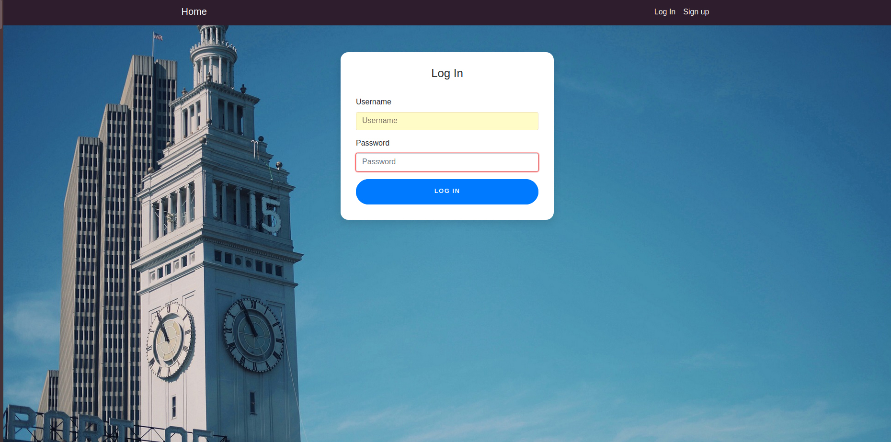

# Let's Get You a Job

This project intends to minimize the time needed for users to find, save, and apply for tech jobs in the United States.

## About

This is a project for the coding bootcamp [Kickstart Coding](http://kickstartcoding.com/). It was created with the intention of allowing users to apply for jobs more quickly and easily by eliminating the need to use multiple job search websites. Instead, this project seeks to allow users to rely on simply one job search website. 

### Who is this for

* This is for **any job seekers**, including anyone who is simply curious about finding a job. Users are not required to register in order to use the search engine. However, registered users may bookmark any job listings or apply for the jobs externally. 

### Features

* Easy to use and simple
    * Navigation bar remains on the top of every page
    * Users can easily begin by using the search bar on the home page
    * Users may use the search bar, log in, or sign up for a free account


* Accounts:
    * Log-in and sign-up pages
    * User profile page




* Search Results:
    * All users have access to search results 
    * Search results display position name and location


* Detailed search results
    * Upon clicking a search result, the full job description is displayed 


* Bookmark
    * Registered users may choose to save the position on their accounts 


* Apply
    * Registered users may apply for the position (they will be sent to the official job listing's website and may apply there)

### Running locally

* Requirement: [Pipenv must be installed.](https://github.com/kickstartcoding/pipenv-getting-started)
* Django admin needs to be installed globally. For macOS users, please type `pip3 install django`. For Ubuntu GNU/Linux users, please type `sudo pip3 install django`

## Installation

1. Please run this in the command-line:

```bash
git clone https://github.com/backend-project-team3/letsgetyouajob #Git clone repo
```

2. Please go into the newly created project and ensure that you are "next to" `manage.py`. Then please use `pipenv` to set up your virtualenv: 
```
pipenv shell
pipenv install django 
pipenv install --dev
python manage.py makemigrations
python manage.py migrate
python manage.py runserver
```

**Note:** It is possible to get errors while installing `django` and/or `dev`. Possible errors may include `ERROR: ERROR: Package installation failed...`. However, the project should still be able to run once you run the server. 

3. Please type http://127.0.0.1:8000/ in your browser. The site should appear.

## Credits

* Photography Credit:
    * https://github.com/devdav1999/
